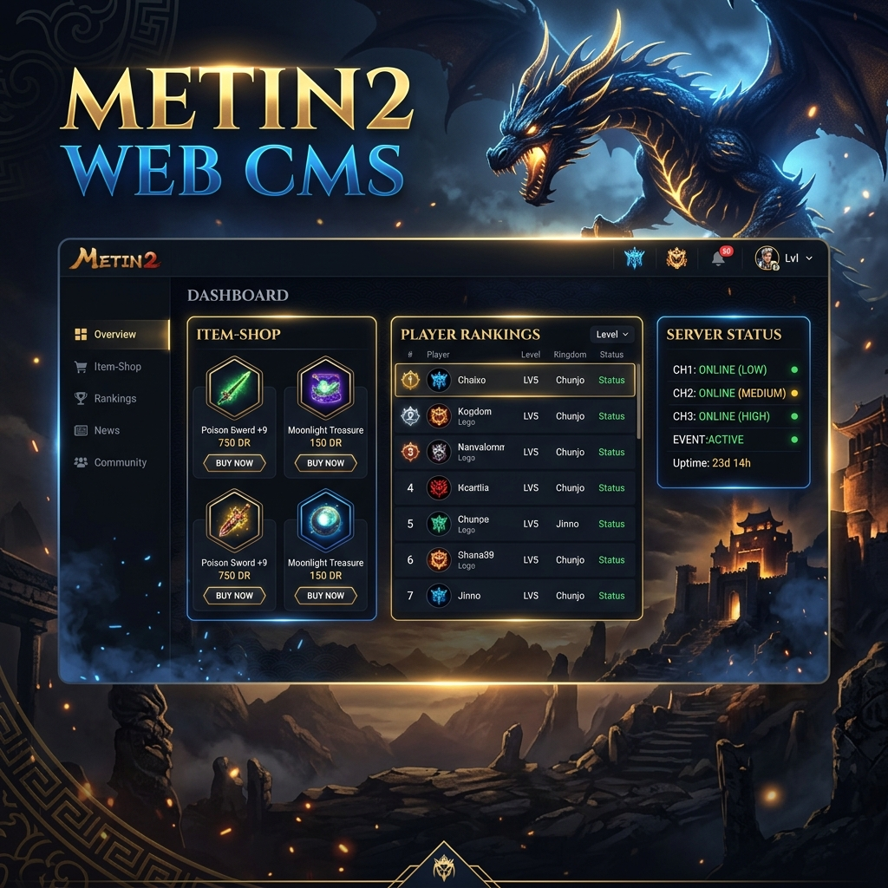

<div align="center">
  
  
  # 🐉 Metin2 Web-CMS (Basic Edition)
  
  [](https://github.com/stb-srv/Metin2-Web-CMS-Basic)
  [](LICENSE)
  [](https://nodejs.org/)
  [](https://expressjs.com/)
  [](https://www.mysql.com/)

  **Ein vollständiges, modernes und performantes Web-Panel für Metin2 Privatserver.**  
  *Verwalte deinen Server, deinen Item-Shop und deine Spieler mit Leichtigkeit.*
</div>

---

## 🌟 Überblick

Das **Metin2 Web-CMS** ist eine leichtgewichtige, aber mächtige Lösung für Serverbetreiber, die eine moderne Weboberfläche ohne unnötigen Ballast suchen. Es bietet ein integriertes Shop-System, Account-Management, Ranglisten und ein umfassendes Admin-Dashboard.

### ✨ Kern-Features

#### 🏠 Frontend & User-Experience
- **Modernes UI/UX**: Vollständig responsives Design mit Dark- & Light-Mode.
- **Interaktive Startseite**: Login & Registrierung mit flüssigen Animationen und Partikel-Effekten.
- **Live-Statistiken**: Echtzeit-Anzeige des Server-Status (Online-Spieler, Channel-Status).

#### 🛒 Item-Shop & Web-Lager
- **Vollwertiger Shop**: Unterstützung für DR (Drachenmünzen) und DM (Drachenmarken).
- **Cashback-System**: Automatische DM-Belohnungen bei Käufen mit DR.
- **Customization**: Sockets (Steine) und bis zu 7 Boni pro Item konfigurierbar.
- **Web-Lager (Stash)**: Gekaufte Items sicher zwischenlagern, abholen oder im Mülleimer (7 Tage Frist) verwalten.

#### 👤 Account-Management
- **Sicherheit**: Passwort-Hashing kompatibel mit Metin2 SHA1.
- **Self-Service**: Löschcode (Social ID) und Passwort bequem über den Browser ändern.
- **Charakter-Übersicht**: Detaillierte Ansicht aller Charaktere inkl. Level, Klasse und Spielzeit.

#### 🛡️ Admin-Power
- **Intuitive Verwaltung**: Tab-basiertes Interface für Shop, CMS, Spieler und Team.
- **Geschenk-System**: Sende Items oder Währungen direkt an Accounts.
- **Bann-Management**: Umfassende Historie und einfache Sperrung von Accounts.
- **Rollen-System**: Granulare Berechtigungen für verschiedene Team-Ränge.

---

## 🛠️ Technologie-Stack

| Komponente | Technologie |
|---|---|
| **Backend** | [Node.js](https://nodejs.org/) mit [Express.js](https://expressjs.com/) |
| **Datenbank** | [MySQL](https://www.mysql.com/) / [MariaDB](https://mariadb.org/) |
| **Frontend** | Vanilla JS, HTML5, CSS3 (Modern UI) |
| **Auth** | JSON Web Tokens (JWT) & Cookie-Parsing |
| **Logging** | Winston & Daily Rotate Files |

---

## 🚀 Schnellstart

### 1. Voraussetzungen
- Ein installierter Metin2-Server (Datenbanken: `account`, `player`, `common`)
- Linux (Ubuntu/Debian empfohlen) oder Windows Server
- Node.js 18 oder höher

### 2. Installation
Klone das Repository und führe das Installationsskript aus:

```bash
git clone https://github.com/stb-srv/Metin2-Web-CMS-Basic.git
cd Metin2-Web-CMS-Basic
chmod +x install.sh
sudo ./install.sh
```

### 3. Setup
Starte den Server und folge dem automatischen Web-Setup:

```bash
npm install
npm start
```
Besuche nun `http://DEINE-IP:3000` in deinem Browser.

> [!TIP]
> Für detaillierte Anweisungen siehe die **[INSTALL.md](INSTALL.md)**.

---

## 📁 Projektstruktur

```text
metin2-web/
├── server/             # Backend-Logik (Express Routen & Middleware)
├── public/             # Frontend-Dateien (HTML, CSS, JS, Bilder)
├── database.js         # Datenbank-Konfiguration
├── server.js           # Haupteinstiegspunkt
└── .env                # Umgebungsvariablen (wird via Setup generiert)
```

---

## 📝 Lizenz & Support

Dieses Projekt ist unter der **MIT-Lizenz** lizenziert. Es ist für den privaten Gebrauch und die Metin2-Community bestimmt.

**Entwickelt mit ❤️ für die Metin2-Community.**
